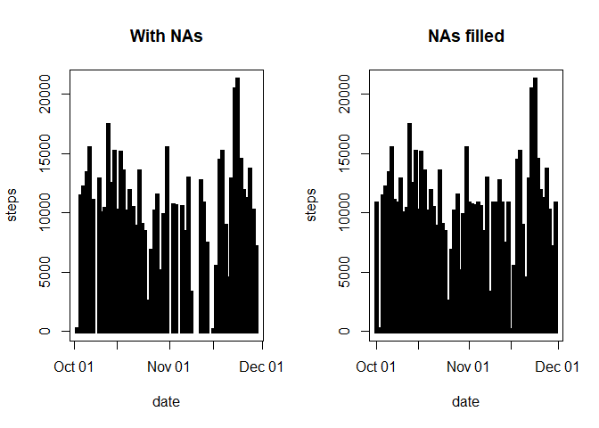
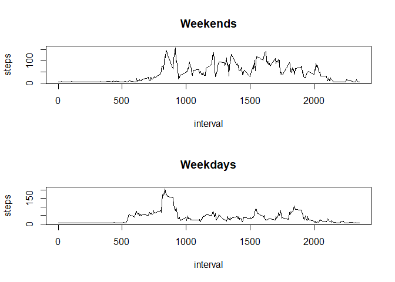

```r
echo = TRUE  
```

# Loading and preprocessing the data

```r
activity_data <- read.csv(unz("activity.zip", "activity.csv"))
str(activity_data)
```

```
## 'data.frame':	17568 obs. of  3 variables:
##  $ steps   : int  NA NA NA NA NA NA NA NA NA NA ...
##  $ date    : Factor w/ 61 levels "2012-10-01","2012-10-02",..: 1 1 1 1 1 1 1 1 1 1 ...
##  $ interval: int  0 5 10 15 20 25 30 35 40 45 ...
```
Change date variable to from Factor to Date


```r
activity_data$date <- as.Date(activity_data$date, format = "%Y-%m-%d")
```

# What is mean total number of steps taken per day?
## Find total number of steps taken on each day

```r
Total_Steps_Day <- aggregate(steps ~ date, rm.na = TRUE, data = activity_data, FUN = sum)
```
## Plot daily stps

```r
plot(Total_Steps_Day, type = "h", lwd = 10, lend = "square")
```

<!-- -->


## mean and median Steps

```r
mean_steps <- aggregate(steps ~ date, rm.na = TRUE, data = activity_data, FUN = mean)
median_steps <- aggregate(steps ~ date,  rm.na = TRUE,data = activity_data, FUN = median)
```

## What is the average daily activity pattern?

```r
plot(aggregate(steps ~ interval, data = activity_data, FUN = mean), type = "l")
```

<!-- -->

## The 5-minute interval that, on average, contains the maximum number of steps

```r
max(activity_data$steps, na.rm = TRUE)
```

```
## [1] 806
```

## Imputing missing values

First check how many missing valeus are there


```r
sum(is.na(activity_data))
```

```
## [1] 2304
```

I am going to make a copy of activity_data and fill the Steps null values with mean of not null values for steps


```r
activity_refined <- activity_data
activity_refined$steps[is.na(activity_refined$steps)] <- mean(na.omit(activity_refined$steps))
```

Make a histogram of the total number of steps taken each day and Calculate and report the mean and median total number of steps taken per day. Do these values differ from the estimates from the first part of the assignment? What is the impact of imputing missing data on the estimates of the total daily number of steps?

First we will find the total number of steps taken on activity_refined [With NAs Filled]


```r
Total_Steps_Day2 <- aggregate(steps ~ date, rm.na = TRUE, data = activity_refined, FUN = sum)
```

Now we will plot both charts and compare


```r
par(mfrow=c(1,2))
plot(Total_Steps_Day, type = "h", lwd = 5,lend = "square", main = "With NAs")
plot(Total_Steps_Day2, type = "h", lwd = 5, lend = "square", main = "NAs filled")
```

<!-- -->

We can say filling the NA makes the distribution more homogeneous.

## Are there differences in activity patterns between weekdays and weekends?

We need to create a factor variable whether the activity date is a weekday or weekend


```r
activity_refined$weekday <- factor(weekdays(activity_refined$date))

levels(activity_refined$weekday) <- list(weekday = c("Monday", "Tuesday",
                                              "Wednesday", "Thursday",
                                              "Friday"), weekend =
                                          c("Saturday", "Sunday"))
```

now plot the graph and compare the activity between weekday and weekend


```r
par(mfrow = c(2, 1))

with(activity_refined[activity_refined$weekday == "weekend",], plot(aggregate(steps ~ interval, FUN = mean), type = "l", main = "Weekends"))

with(activity_refined[activity_refined$weekday == "weekday",], plot(aggregate(steps ~ interval, FUN = mean), type = "l", main = "Weekdays"))
```

<!-- -->


```r
dev.off()
```

```
## null device 
##           1
```
